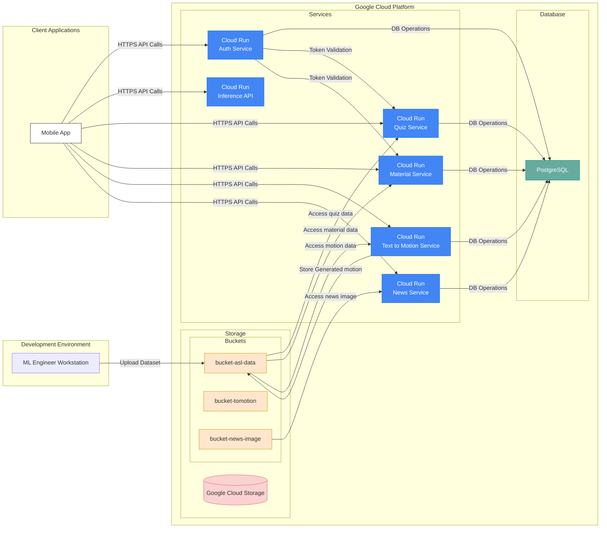

```mermaid
graph LR
    subgraph "Development Environment"
        ML[ML Engineer Workstation]
    end

    subgraph "Google Cloud Platform"
        subgraph "Storage"
            GCS[("Google Cloud Storage")]
            subgraph "Buckets"
                Dataset[bucket-asl-data]
                Model[bucket-tomotion]
                ImageBucket[bucket-news-image]
            end
        end

        subgraph "Database"
            SQL["PostgreSQL"]
        end

        subgraph "Services"
            CR1["Cloud Run<br/>Auth Service"]
            CR2["Cloud Run<br/>Inference API"]
            CR3["Cloud Run<br/>Quiz Service"]
            CR5["Cloud Run<br/>Material Service"]
            CR6["Cloud Run<br/>Text to Motion Service"]
            CR7["Cloud Run<br/>News Service"]
        end
    end

    subgraph "Client Applications"
        Mobile["Mobile App"]
    end

    %% Development Flow
    ML -->|"Upload Dataset"| Dataset
    
    %% Model & Dataset Access
    Dataset -->|"Access quiz data"| CR3
    Dataset -->|"Access material data"| CR5
    Dataset -->|"Access motion data"| CR6
    ImageBucket -->|"Access news image"| CR7
    CR6 -->|"Store Generated motion"| Dataset

    %% Database Connections
    CR1 -->|"DB Operations"| SQL
    CR3 -->|"DB Operations"| SQL
    CR5 -->|"DB Operations"| SQL
    CR6 -->|"DB Operations"| SQL
    CR7 -->|"DB Operations"| SQL

    %% Service Communications
    CR1 -->|"Token Validation"| CR3
    CR1 -->|"Token Validation"| CR5

    %% Client Communications
    Mobile -->|"HTTPS API Calls"| CR1
    Mobile -->|"HTTPS API Calls"| CR2
    Mobile -->|"HTTPS API Calls"| CR3
    Mobile -->|"HTTPS API Calls"| CR5
    Mobile -->|"HTTPS API Calls"| CR6
    Mobile -->|"HTTPS API Calls"| CR7

    classDef gcpService fill:#4285f4,stroke:#1a73e8,color:white;
    classDef storage fill:#fad2d2,stroke:#e06666;
    classDef client fill:#fff,stroke:#333;
    classDef bucket fill:#ffe6cc,stroke:#d79b00;
    classDef database fill:#67AB9F,stroke:#008975,color:white;

    class GCS storage;
    class Dataset,Model,ImageBucket,NewsBucket bucket;
    class CR1,CR2,CR3,CR5,CR6,CR7 gcpService;
    class Mobile client;
    class SQL database;
```
