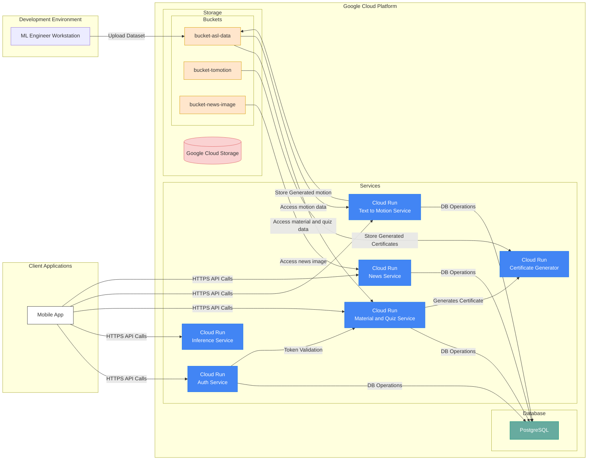

## Sign Master

## About This Project
Sign Master is an innovative application designed to support the deaf and mute community, their families, and close connections. It addresses key challenges such as the limited resources and limited communication opportunities. By leveraging AI-powered tools for gesture recognition and interactive learning modules, Sign Master enables smooth conversations between deaf individuals and their loved ones, fostering stronger bonds and breaking communication barriers. This ensures the community feels empowered, supported, and included.

The app also caters to two additional groups: individuals learning sign language for personal growth and professionals such as educators or customer service representatives who need it for their careers. With structured modules, gamified quizzes, and certifications, Sign Master makes the learning process engaging and effective. By bridging communication gaps and promoting inclusivity, the app helps foster societal understanding and respect for the deaf community.

## Team Member C242-PS363

| Bangkit ID | Name | Learning Path | LinkedIn Profile | Status |
|:----------:|------|:------------:|:-------|------------------|
| M008B4KY2566 | Mohammad Fajar Maulid | Machine Learning | [LinkedIn](https://www.linkedin.com/in/fajar-maulid-2665b81b1/) | Active |
| M008B4KY2883 | Muhammad Hariish Hafiiz | Machine Learning | [LinkedIn](https://www.linkedin.com/in/muhammad-hariish-hafiiz-84b15b2a5/) | Active |
| M008B4KY4525 | Yazid Rizki Kurniawan | Machine Learning | [LinkedIn](https://www.linkedin.com/in/yazid-rizki-kurniawan-521237154/) | Active |
| C008B4KY1542 | Fitriansyah Eka Putra | Cloud Computing | [LinkedIn](https://www.linkedin.com/in/fitriansyah-eka-putra-417049199/) | Active |
| C008B4KY3671 | Rakyan Pangrukti Wibana | Cloud Computing | [LinkedIn](https://www.linkedin.com/in/rakyanwibana/) | Active |
| A529B4KY0766 | Aziz Nur Ashidiq | Mobile Development | [LinkedIn](https://www.linkedin.com/in/aziz-nur-ashidiq-466b39218/) | Active |
| A529B4KY2683 | Muhammad Adira Zaidan Putra Pratama | Mobile Development | [LinkedIn](https://www.linkedin.com/in/adira-zaidan-b457082b5/) | Active |

 ## Project Architecture 

## Machine Learning
TODO

## Cloud Computing
[Inference Service](https://github.com/Bangkit-Capstone-Project-C242-PS363/service-toMotion.git)

[Auth Service](https://github.com/Bangkit-Capstone-Project-C242-PS363/service-auth.git)

[Material and Quiz Service](https://github.com/Bangkit-Capstone-Project-C242-PS363/service-material-quiz)

[Text to Motion Service](https://github.com/Bangkit-Capstone-Project-C242-PS363/service-toMotion.git)

[News Service](https://github.com/Bangkit-Capstone-Project-C242-PS363/service-news)

## Mobile Development
TODO
