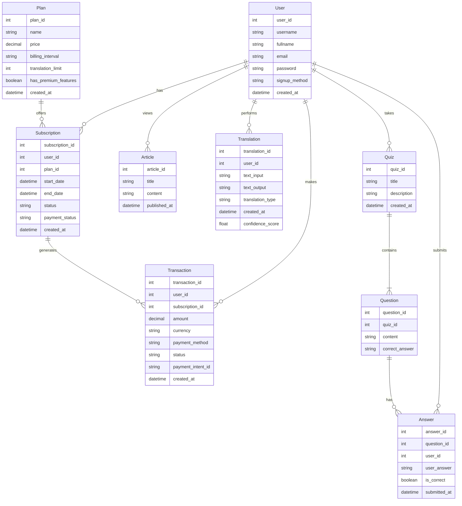
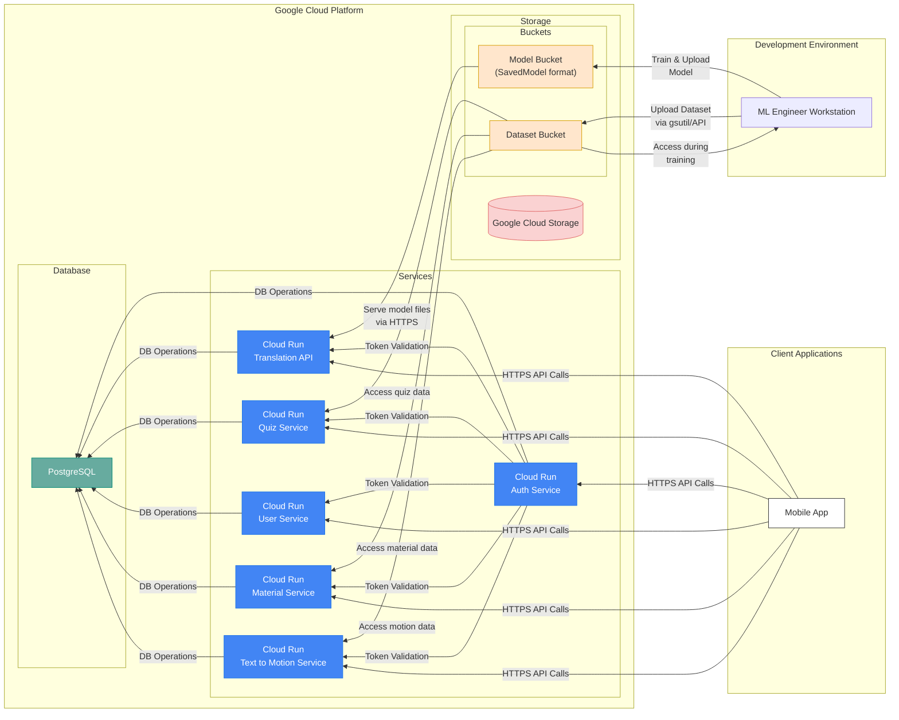

```mermaid
erDiagram
    User ||--o{ Answer : submits
    User ||--o{ Quiz : takes
    User ||--o{ Article : views
    User ||--o{ Translation : performs
    User ||--o{ Subscription : has
    User ||--o{ Transaction : makes
    Quiz ||--|{ Question : contains
    Question ||--o{ Answer : has
    Plan ||--o{ Subscription : offers
    Subscription ||--o{ Transaction : generates

    User {
        int user_id
        string username
        string fullname
        string email
        string password
        string signup_method
        datetime created_at
    }
    
    Quiz {
        int quiz_id
        string title
        string description
        datetime created_at
    }
    
    Question {
        int question_id
        int quiz_id
        string content
        string correct_answer
    }
    
    Answer {
        int answer_id
        int question_id
        int user_id
        string user_answer
        boolean is_correct
        datetime submitted_at
    }
    
    Article {
        int article_id
        string title
        string content
        datetime published_at
    }
    
    Translation {
        int translation_id
        int user_id
        string text_input
        string text_output
        string translation_type
        datetime created_at
        float confidence_score
    }

    Plan {
        int plan_id
        string name
        decimal price
        string billing_interval
        int translation_limit
        boolean has_premium_features
        datetime created_at
    }

    Subscription {
        int subscription_id
        int user_id
        int plan_id
        datetime start_date
        datetime end_date
        string status
        string payment_status
        datetime created_at
    }

    Transaction {
        int transaction_id
        int user_id
        int subscription_id
        decimal amount
        string currency
        string payment_method
        string status
        string payment_intent_id
        datetime created_at
    }

```


```mermaid
graph RL
    subgraph "Development Environment"
        ML[ML Engineer Workstation]
    end

    subgraph "Google Cloud Platform"
        subgraph "Storage"
            GCS[("Google Cloud Storage")]
            subgraph "Buckets"
                Dataset["Dataset Bucket"]
                Model["Model Bucket<br/>(SavedModel format)"]
            end
        end

        subgraph "Database"
            SQL["PostgreSQL"]
        end

        subgraph "Services"
            CR1["Cloud Run<br/>Auth Service"]
            CR2["Cloud Run<br/>Translation API"]
            CR3["Cloud Run<br/>Quiz Service"]
            CR4["Cloud Run<br/>User Service"]
            CR5["Cloud Run<br/>Material Service"]
            CR6["Cloud Run<br/>Text to Motion Service"]
        end
    end

    subgraph "Client Applications"
        Mobile["Mobile App"]
    end

    %% Development Flow
    ML -->|"Upload Dataset<br/>via gsutil/API"| Dataset
    ML -->|"Train & Upload<br/>Model"| Model
    
    %% Model & Dataset Access
    Model -->|"Serve model files<br/>via HTTPS"| CR2
    Dataset -->|"Access during<br/>training"| ML
    Dataset -->|"Access quiz data"| CR3
    Dataset -->|"Access material data"| CR5
    Dataset -->|"Access motion data"| CR6

    %% Database Connections
    CR1 -->|"DB Operations"| SQL
    CR2 -->|"DB Operations"| SQL
    CR3 -->|"DB Operations"| SQL
    CR4 -->|"DB Operations"| SQL
    CR5 -->|"DB Operations"| SQL
    CR6 -->|"DB Operations"| SQL

    %% Service Communications
    CR1 -->|"Token Validation"| CR2
    CR1 -->|"Token Validation"| CR3
    CR1 -->|"Token Validation"| CR4
    CR1 -->|"Token Validation"| CR5
    CR1 -->|"Token Validation"| CR6

    %% Client Communications
    Mobile -->|"HTTPS API Calls"| CR1
    Mobile -->|"HTTPS API Calls"| CR2
    Mobile -->|"HTTPS API Calls"| CR3
    Mobile -->|"HTTPS API Calls"| CR4
    Mobile -->|"HTTPS API Calls"| CR5
    Mobile -->|"HTTPS API Calls"| CR6

    classDef gcpService fill:#4285f4,stroke:#1a73e8,color:white;
    classDef storage fill:#fad2d2,stroke:#e06666;
    classDef client fill:#fff,stroke:#333;
    classDef bucket fill:#ffe6cc,stroke:#d79b00;
    classDef database fill:#67AB9F,stroke:#008975,color:white;

    class GCS,Dataset,Model storage;
    class CR1,CR2,CR3,CR4,CR5,CR6 gcpService;
    class Web,Mobile client;
    class Dataset,Model bucket;
    class SQL database;

```

# API Documentation

## Table of Contents
- [Authentication](#authentication)
- [Base URLs](#base-urls)
- [Authentication Service](#authentication-service)
- [User Service](#user-service)
- [Translation Service](#translation-service)
- [Quiz Service](#quiz-service)
- [Error Handling](#error-handling)

## Base URLs

| Services | Base URL                                    |
|------------|---------------------------------------------|
| Authentication | `https://signmaster-auth-304278585381.asia-southeast2.run.app`          |

### Authentication Service

1. Register New User
```http
POST /auth/register

Request Body:
{
  "username": "string",
  "email": "string",
  "password": "string",
  "confirmPassword": "string",
}

Response (201 Created):
{
  "massage": "string",
  "token": "string"
}
```

2. Login
```http
POST /auth/login

Request Body:
{
  "email": "string",
  "password": "string"
}

Response (200 OK):
{
  "massage": "string",
  "token": "string",
}
```
3. Test restriction
```http
DELETE /auth/restriction
Authorization: Bearer <your_jwt_token>

Response (200 OK):
{
  "message": "string",
}
```

### User Service

1. Get User Profile
```http
GET /users/profile
Authorization: Bearer <your_jwt_token>

Response (200 OK):
{
  "userId": "string",
  "username": "string",
  "email": "string",
  "fullName": "string",
  "progress": {
    "completedLessons": ["lesson ids"],
  }
}
```

### Translation Service (blum fix)

1. Translate Text
```http
POST /translate
Authorization: Bearer <your_jwt_token>

Request Body:
{
  "text": "string",
  "sourceLanguage": "string",
  "targetLanguage": "string"
}

Response (200 OK):
{
  "translatedText": "string",
  "confidence": "number",
  "alternatives": [
    {
      "text": "string",
      "confidence": "number"
    }
  ]
}
```

2. Get Translation History
```http
GET /translate/history
Authorization: Bearer <your_jwt_token>

Query Parameters:
- page (optional): Page number (default: 1)
- limit (optional): Items per page (default: 10)

Response (200 OK):
{
  "translations": [
    {
      "id": "string",
      "originalText": "string",
      "translatedText": "string",
      "sourceLanguage": "string",
      "targetLanguage": "string",
      "timestamp": "string"
    }
  ],
  "pagination": {
    "currentPage": "number",
    "totalPages": "number",
    "totalItems": "number"
  }
}
```

### Quiz Service

1. Create Quiz
```http
POST /quizzes
Authorization: Bearer <your_jwt_token>

Request Body:
{
  "topics": ["string"],
  "questionCount": "number"
}

Response (201 Created):
{
  "quizId": "string",
  "questions": [
    {
      "id": "string",
      "text": "string",
      "options": ["string"],
      "correctOption": "number"
    }
  ]
}
```

2. Submit Quiz Answer
```http
POST /quizzes/{quizId}/answers
Authorization: Bearer <your_jwt_token>

Request Body:
{
  "questionId": "string",
  "selectedOption": "number"
}

Response (200 OK):
{
  "correct": "boolean",
  "explanation": "string",
  "score": "number"
}
```

3. Get Quiz Results
```http
GET /quizzes/{quizId}/results
Authorization: Bearer <your_jwt_token>

Response (200 OK):
{
  "quizId": "string",
  "score": "number",
  "totalQuestions": "number",
  "correctAnswers": "number",
  "completedAt": "string",
  "questions": [
    {
      "id": "string",
      "text": "string",
      "userAnswer": "number",
      "correctAnswer": "number",
      "correct": "boolean"
    }
  ]
}
```

### Error Handling
```http
Error Response Format:
{
  "error": {
    "code": "string",
    "message": "string",
    "details": "object (optional)"
  }
}

Common Error Codes:
400 - Bad Request - Invalid input parameters
401 - Unauthorized - Authentication required
403 - Forbidden - Insufficient permissions
404 - Not Found - Resource doesn't exist
429 - Too Many Requests - Rate limit exceeded
500 - Internal Server Error
```

### Rate Limiting
```http
Rate limits:
- 100 requests per minute for authenticated users
- 20 requests per minute for unauthenticated users

Rate limit headers:
X-RateLimit-Limit: 100
X-RateLimit-Remaining: 95
X-RateLimit-Reset: 1628789000
```
